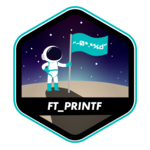

<h1> Hello, I'm Roger Vidal!</h1>


[](https://www.linkedin.com/in/rog%C3%A9rio-vidal-a45201271/)

 About myself:

```cpp
#include <iostream>
#include <string>

using namespace std;

class Person {
  public:
    string          name;
    int             age;
    string          nativeFrom;
    vector<string>  spokenLanguages
    vector<string>  familiarProgmmingLanguages;
};

int main(void) {
  Person myself;
  myself.name = "Roger Vidal";
  myself.age = 30;
  myself.spokenLanguages.push_back("Portuguese - Native");
  myself.spokenLanguages.push_back("English - Fluent");
  myself.familiarProgammingLanguagespush_back("C#");
  myself.familiarProgammingLanguagespush_back("JavaScript / Typescript");
  myself.familiarProgammingFrameworkpush_back("React");

  return (0);
}
```

### 42's Projects Already Graded 





